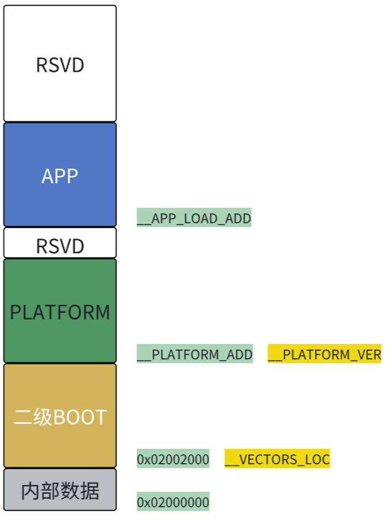
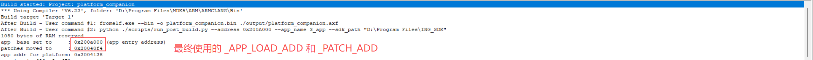
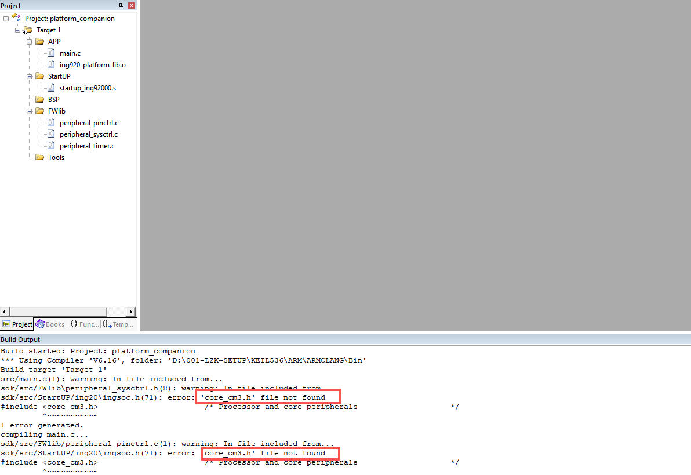
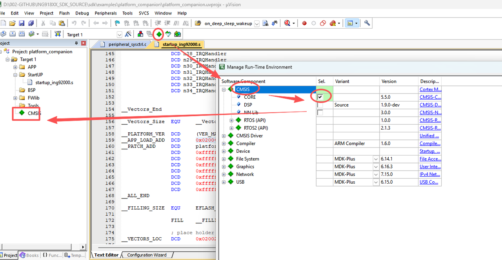
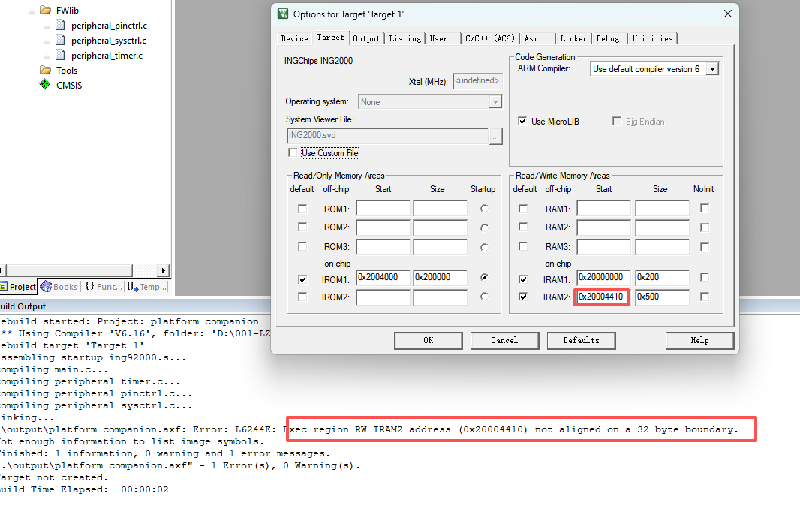
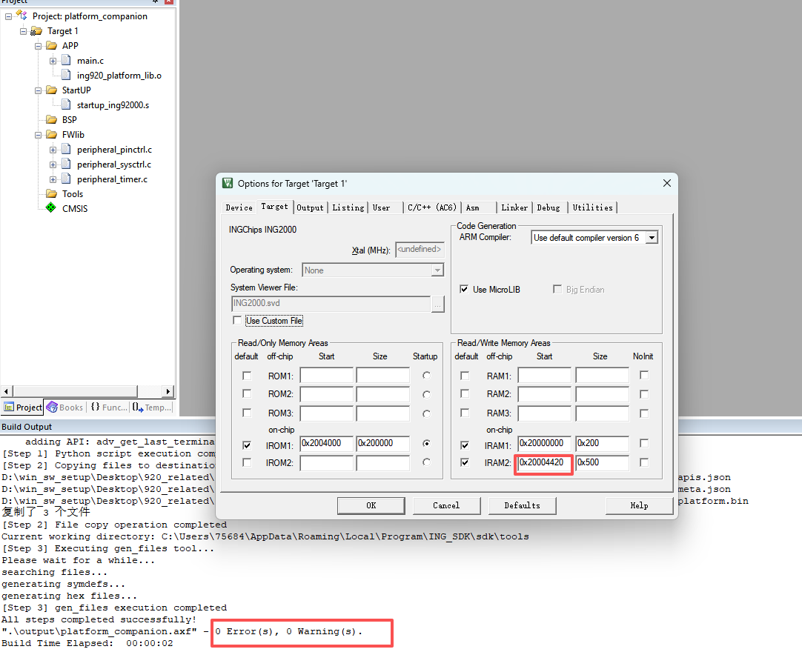
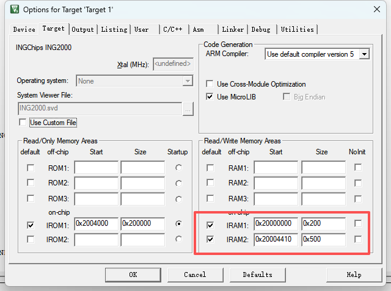

# 1. 概述

* 本工程为 ING20xx 二级 bootloader 雏形例程，可实现 `二级 BOOT`-> `platform` -> `APP` 的执行演示，方便后续开发与实现；
* 本例程使用的 SDK 版本为 9.0.4 之后的某个 develop 分支，之前的版本无法支持；
* 本例程二级 BOOT 实现了跳转及固件搬运功能，其余行为需自行添加。

# 2. 前置条件

1. 安装 [ING SDK](https://ingchips.github.io/docs/sdk/download/);
2. 安装 Python 环境。

# 3. 文件夹介绍

```
ING20xx/                      # 工程根目录
├── 1_secondary_bootloader/   # 二级 bootloader 工程，纯裸机实现，不依赖 platform
├── 2_platform_companion/     # platform(patch) 例程，编译 platform.bin 文件，注意编译完会通过脚本修改 bin 文件内容，核心调用脚本及修改项详见 scripts 文件夹 run_post_build.py make_bundle.py 脚本内容
├── 3_app/                    # APP 应用例程，SDK 版本与 2_platform_companion 保持一致
```

# 4. Flash 分布及相应说明
整个工程分为三个部分：二级 bootloader、platform(patch)、APP，在 Flash 的中分布如图所示：


## 各部分介绍
* **内部数据**：原厂内部存储数据，比如 FT 数据等，该区域不开放使用。
* **二级 Boot**：用户维护 IAP 升级程序，支持自定义修改，不支持蓝牙，仅支持 USB、UART 等外设接收固件进行升级，可以根据功能不同自定义固件大小。起始地址应始终放到芯片 FLASH 开始启动的位置 `0x02002000`，逻辑上就是永远在可能被升级的程序之前先被启动，同样的，为避免变砖的可能性出现，在一个产品生命周期内，**二级 Boot 应固化在这个区域永远不能被升级**。
* **PLATFORM**：原厂维护协议栈 PATCH 程序，部分开放，用户尽量不修改，必要时可做少量修改。**起始地址 `__PLATFORM_ADD` 可以自定义放置到二级 Boot 之后，最好是贴着二级 Boot 放置**，节省空间，比如二级 Boot 的大小为 8KB，则 PLATFORM 的起始地址可以为 0x02004000。**`__PLATFORM_ADD` 由二级 Boot 决定，固化后不可改变。**
* **APP**: 用户维护应用程序。**起始地址 `__APP_LOAD_ADD` 可以自定义放置到 PLATFORM 之后，`__APP_LOAD_ADD` 也由二级 Boot 决定，固化后不可改变。随着 SDK 的更新，PATCH 可能增大，platform.bin 的大小也会变大，应预留足够的空间给 platform(patch)。如果预留空间不够，后期更新  platform(patch) 会覆盖到 APP 不好解决。** 当前工程 `__APP_LOAD_ADD` 设置为 `0x0200A000`，预留了 `24KB` 给 platform(patch) 使用。

当前工程 Flash 分布如下：

| 地址 | 大小 | 说明 |
| ---- | ---- | ---- |
| 0x2002000 | 0x2000 | secondary_bootloader |
| 0x2004000 | 0x6000 | platform_companion |
| 0x200A000 | \ | APP |

# 5. 使用说明
[工程使用说明](usage.md)

# 6. 注意事项

## secondary bootloader 工程说明
  startup_ing92000.s 启动文件和 main.c 的内容有如下使用说明：
  
  **本启动文件的框架不应该被修改，否则影响启动；**

  * **__BOOT_VER** ：为软件版本说明，每次更新二级 Boot，最好更新它，以便于区分 Boot 版本；

  * **__APP_LOAD_ADD** ：设置 APP 的启动地址，它总是应该与 APP 的启动地址保持一致，否则无法启动，**所以它总是应该在新的项目启动前被提前规划，且一旦定下来，在产品声明周期内，APP的启动地址不应该被改变。** APP 地址获取方式见后续 __PATCH_ADD 介绍中的图片截图。

  * **__PATCH_ADD**：设置芯片 ROM 补丁包首地址，供 ROM 调用。其地址应由 platform 例程编译且调用脚本修改之后生成，在 keil 的编译窗口可以看到，make_bundle.py 脚本会对 bin 文件中实际使用的 `__APP_LOAD_ADD` 和 `__PATCH_ADD` 进行更改，如下图所示。

    

    * **需要注意的是：**
    * `__PATCH_ADD 与两个地址有关，一个是“platform 例程首地址值”，另一个是“platform 首地址到实际 patch 的偏移值”，当设置好 platform 例程的首地址和 platform 例程启动文件中的 app 首地址（__APP_LOAD_ADD）后，编译 platform_companion 的例程后运行脚本会自动计算它的值。`
      * `__PATCH_ADD 会根据 platform 例程首地址的偏移而偏移，每次 platform 首地址更新时，二级 Boot 的启动文件中的 __PATCH_ADD 一定要更新。所以，量产不同项目时，如果二级 boot 预留 flash 空间大小不同，即 platform 首地址不同，那么 __PATCH_ADD 肯定不同。`
      
    * `关于 platform 首地址到实际 patch 相对偏移值，理论上在后续 ROM 更新时不再改变，但是目前阶段只有测试版本芯片，等量产芯片出来时，还是会再变一次的，后续量产版本将不再改变，所以，量产前应该对 __PATCH_ADD 进行修改`
    
  * **__PLATFORM_ADDR**:  platform 的跳转地址，根据地址规划提前设定。
  
  * **中断向量表**：带二级 boot 方案中，所有中断向量表使用的是二级 boot 的启动文件中对应内容。
---
## platform companion 工程说明
  startup_ing92000.s启动文件的内容有如下使用说明：

  * **`__PLATFORM_VER`**：设置 platform 的版本号。
  * **`__APP_LOAD_ADD` 和 `__PATCH_ADD`**：当二级boot存在时，这两个值没有实际意义，会使用二级 boot 那边对应的值。
---
## ING20 ROM Companion 编译报错找不到 core_cm3.h？


增加CMSIS的core文件即可：


---
## ING20 ROM Companion 切换编译器版本 6 报错未 32 字节对齐？


将 IRAM2 的 Start 地址增大最少字节数（上图应增加 16），使其 32 字节对齐即可（需要注意的是，不能减少 Start 值来对齐，因前面内存已有其它安排不能占用，另外，当增大 Start 值后，编译无法通过时，需要同步增大 Size 值），修改后如下：


---
## ING20 ROM Companion 例程 RAM 设置注意什么？

注意事项：
* IRAM1 为 platform 临时使用，IRAM2 为持续使用，应用 APP 均不能用；
* IRAM1 和 IRAM2 之间的部分（0x20000200~0x20004410）没有在本工程使用，但是 ROM 有使用，所以应用 APP 也不能用；
* 当有二级 Boot 时，因二级 Boot 跳转到 platform 后便会释放 ram 资源，且其在程序启动最开始的位置，所以，二级 Boot 使用的 ram 应当是可随意使用的，需要特别注意的是，对应的 ram 应在硬件上已经配置为 sys ram 了，这个可以通过测试确认。
---
## ING20 ROM Companion 例程编译后需要注意什么？
- 无论以什么原因编译该例程后，均会触发 make_bundles.py 等脚本，从而改变应用使用的 bundles，所以需要重新 check & fix 应用例程 APP，否则 IROM 或 IRAM 等配置可能不正确，导致程序运行异常；