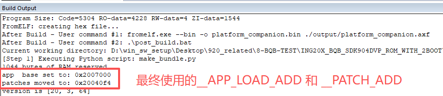

# 工程说明

* 本工程为二级boot早期研发雏形例程，可实现二级BOOT（启动地址0x2002000）->platform->APP的执行演示，方便后续IAP升级的开发与实现。
* 本工程以BQB测试程序为例。
* 由于软件架构限制，制作二级BOOT有一些特别注意事项，后续会加以说明。

* 本例程使用的SDK版本为9.0.4之后的某个develop分支，之前的版本无法支持。

* 制作二级BOOT需注意限制部分，后续介绍。

* 本例程二级BOOT仅实现跳转功能，升级行为和框架需另外添加，可在第一个客户导入前沟通需求，制作demo，在客户试用稳定后，定型框架，推广使用。

* 相对于916的4K限制，它不一定要限制到4K，可以更灵活。

# 文件夹介绍

* 1_BOOT：二级BOOT工程，基于platform_companion修改而来；
* 2_PLATFORM_SDK904DVP：platform例程，编译platform.bin文件，注意编译完会通过脚本修改bin文件内容，脚本见：post_build.bat，核心调用脚本及修改项详见scripts文件夹make_bundle.py脚本内容；
* 3_ING20X_ROM_BQB_SDK904DVP：BQB的APP应用例程。

# 注意事项

* **二级BOOT工程（1_BOOT）**内startup_ing92000.s启动文件和main.c的内容有如下使用说明：

  * **本启动文件的框架不应该被修改，否则影响启动；**

  * **__BOOT_VER** ：为boot版本说明，每次更新二级boot，最好更新它，以便于区分boot版本；

  * **__APP_LOAD_ADD** ：设置APP的启动地址，它总是应该与APP的启动地址保持一致，否则无法启动，所以它总是应该在新的项目启动前被提前规划，且一旦定下来，在产品声明周期内，APP的启动地址不应该被改变。APP地址获取方式见后续__PATCH_ADD介绍中的图片截图。

  * **__PATCH_ADD**：设置芯片ROM补丁包首地址，供ROM调用。其地址应由platform例程编译且调用脚本修改之后生成，在keil的编译窗口可以看到，make_bundle.py脚本会对bin文件中实际使用的`__APP_LOAD_ADD`和`__PATCH_ADD`进行更改，如下图所示。

    

    * **需要注意的是：**
    * `__PATCH_ADD与两个地址有关，一个是”platform例程首地址值“，另一个是“platform首地址到实际patch的偏移值”，当设置好platform例程的首地址和platform例程启动文件中的app首地址（__APP_LOAD_ADD）后，编译platform的例程后运行脚本会自动计算它的值。`
      * `__PATCH_ADD会根据platform例程首地址的偏移而偏移，所以，每次platform首地址更新时，二级BOOT的启动文件中的__PATCH_ADD一定要更新。所以，量产不同项目时，如果二级boot预留flash空间大小不同，即platform首地址不同，那么__PATCH_ADD肯定不同。`
      
    * `关于platform首地址到实际patch相对偏移值，理论上在后续ROM更新时不再改变，但是目前阶段只有测试版本芯片，等量产芯片出来时，还是会再变一次的，后续量产版本将不再改变，所以，量产前应该对__PATCH_ADD进行修改`
    
  * **__PLATFORM_ADDR**:  platform的跳转地址，根据地址规划提前设定。
  
  * 中断向量表：带二级boot方案中，所有中断向量表使用的是二级boot的启动文件中对应内容。
  
* **platform例程（2_PLATFORM_SDK904DVP）**内startup_ing92000.s启动文件的内容有如下使用说明：

  * **`__PLATFORM_VER`**：设置platform的版本号。
  * **`__APP_LOAD_ADD` 和 `__PATCH_ADD`**：当二级boot存在时，这两个值没有实际意义，会使用二级boot那边儿对应的值。