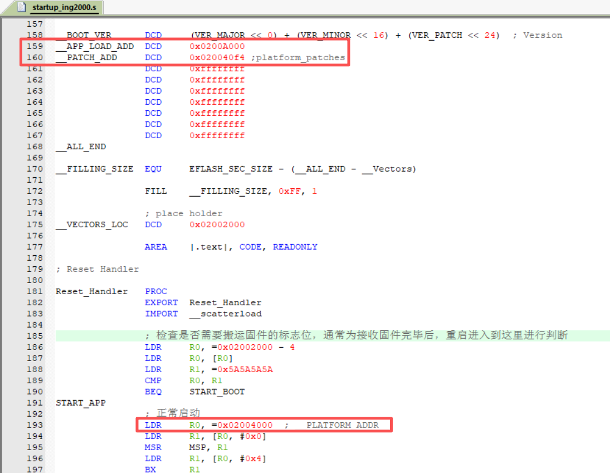
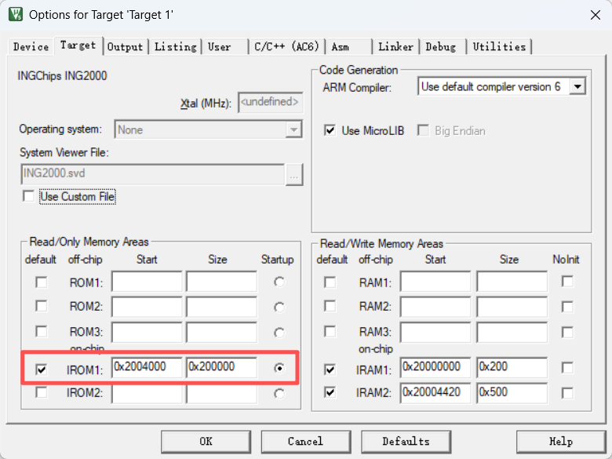
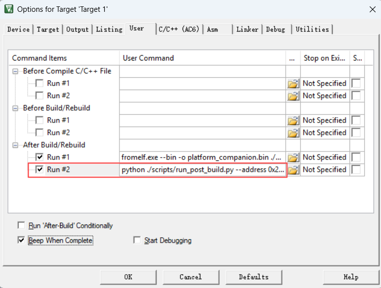
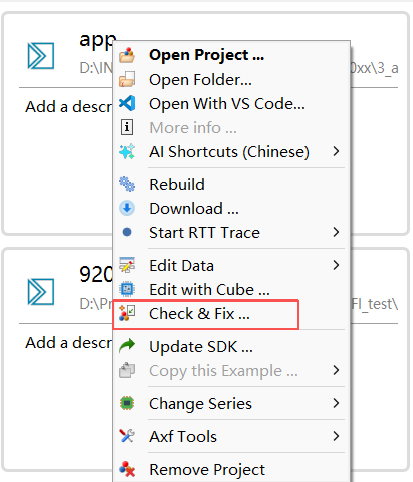
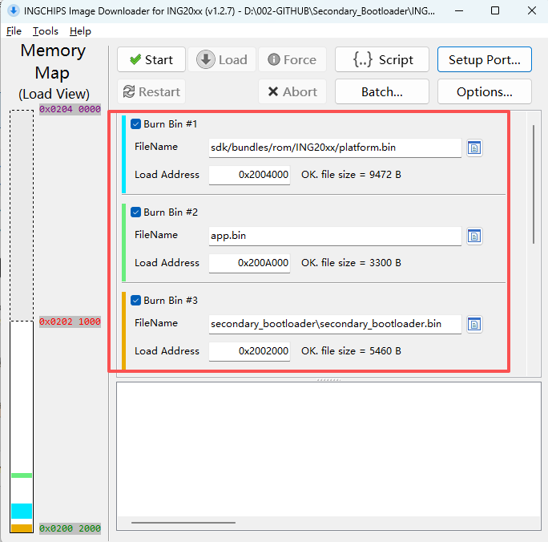
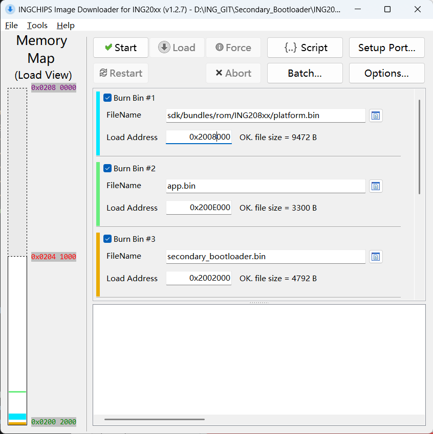
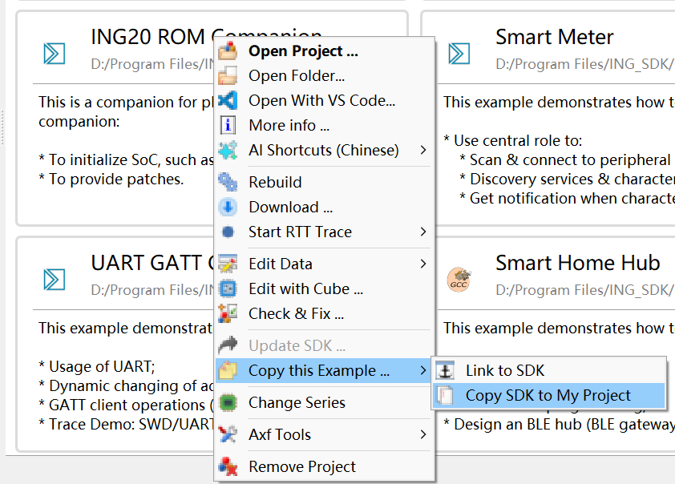

# 1. 编译
## 1_secondary_bootloader 配置和编译
1. 编辑 `startup_ing2000.s` 内 `__PLATFORM_ADDR`、`__APP_LOAD_ADD` 和 `__PATCH_ADD` 的地址，`__PLATFORM_ADDR` 为 platform companion 的起始地址，`__APP_LOAD_ADD` 为 APP 的起始地址，`__PATCH_ADD` 为 platform 首地址到实际 patch 的偏移值，可通过编译 `2_platform_companion` 获得。



2. 直接通过 Keil 进行编译。
3. keil 会执行 `scripts\copy.bat` 脚本，将编译好的 `secondary_bootloader.bin` Copy 到 `3_app\secondary_bootloader` 目录下。

---

##  1_secondary_bootloader_usb 配置和编译
与 `1_secondary_bootloader` 差别不大，注意因为编译出来的固件比 `1_secondary_bootloader` 大，`__PLATFORM_ADDR`、`__APP_LOAD_ADD` 和 `__PATCH_ADD` 的默认地址不一致。

---

## <a id="title2">2_platform_companion 配置和编译</a>
1. 点击工程魔术棒，设置 platform.bin 的 flash 起始地址，该地址受二级 Boot 大小影响，最好紧贴着二级 Boot 放置，`1_secondary_bootloader` 为 `0x2004000`，`1_secondary_bootloader_usb` 为 `0x2008000`,如下图所示：



2. 修改 `After Build/Rebuild` 的 `Run #2`执行的命令：



**命令：**
若使用 `1_secondary_bootloader` ：
```shell
python ./scripts/run_post_build.py --address 0x200A000 --app_name 3_app --sdk_path "D:\Program Files\ING_SDK"
```
若使用 `1_secondary_bootloader_usb` ：
```shell
python ./scripts/run_post_build.py --address 0x200E000 --app_name 3_app --sdk_path "D:\Program Files\ING_SDK"
```

**参数说明：**

|参数  | 描述                              |
|:--------------------|:-----------------------------------------|
|--address      | APP 的 Flash 起始地址，与 `__APP_LOAD_ADD` 一致 |
|--app_name     | APP 工程的目录名称，要求与当前工程放到一个目录下  |
|--sdk_path     | ING SDK 的安装目录，用于获取 generate 等工具     |

3. 直接通过 Keil 进行编译，获取 `__PATCH_ADD`，编译完成后会自动 Copy `SDK\bundles\ING20xx` 目录下的文件到 `3_app` 工程相应目录下。


---

## <a id="title3">3_app 配置和编译</a>
1. 导入该工程到 `ING Wizard` 中，重新 `check & fix` 应用例程 APP，如果提示最新不需要更新，则点击 `Retry`，重新配置。

2. 打开工程，打开魔术棒可以发现 IROM 是从 `__APP_LOAD_ADD` 开始，直接通过 Keil 进行编译。

# 2. 下载验证
1. 通过 ING Wizard 的 Downloader 来烧录固件，Wizard 导入 `3_app` 工程，右键 APP 工程打开 Downloader；或者用 Flash Downloader for ING916xx 打开 `3_app` download.ini，烧录三个固件，三个固件的下载地址如下：

若使用 `1_secondary_bootloader` ：

| 固件名称 | 地址  |
|:--------|:-----|
| secondary_bootloader.bin | 0x2002000 |
| platform.bin    | 0x2004000 |
| app.bin    | 0x200A000 |



若使用 `1_secondary_bootloader_usb` ：

| 固件名称 | 地址  |
|:--------|:-----|
| secondary_bootloader.bin | 0x2002000 |
| platform.bin    | 0x2008000 |
| app.bin    | 0x200E000 |



# 3. 更新 SDK
1. 确保 ING SDK 的版本是需要更新的版本；
2. 在 ING SDK 的安装目录下找到 `sdk` 文件夹，替换掉 `3_app` 工程中的 `sdk` 目录，主要为 `sdk\bundles` 和 `sdk\src` 目录，如果 APP 应用中有修改过 SDK 的部分，请自行移植；
3. 在 ING Wizard 中选择 `Examples`，搜索到 `ING20 ROM Companion` 工程，右键工程 `Copy this Example -> Copy SDK to My Project`，将该工程 Copy 出来:

4. 将 `2_platform_companion/scripts/run_post_build.py` 脚本复制到新的 `platform_companion` 工程一样的目录下；
5. 新的 `platform_companion` 工程按照 [2_platform_companion 配置和编译](#title2)步骤进行配置，如果 `platform_companion` 应用中有修改过的部分，请自行移植，然后替换掉源目录下的 `2_platform_companion` 工程，进行编译；
6. 将 `3_app` 工程按照 [3_app 配置和编译](#title3) 步骤进行配置和编译；
7. 执行烧录，验证。